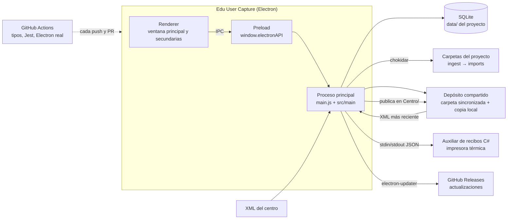
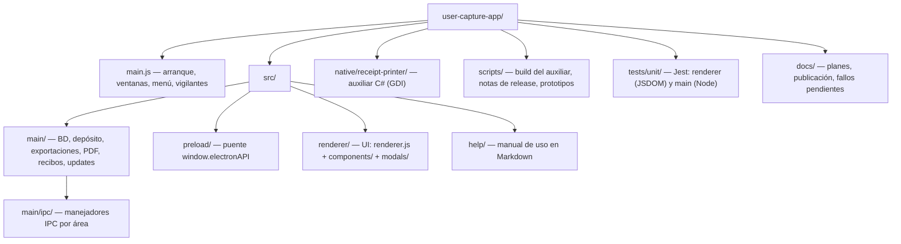
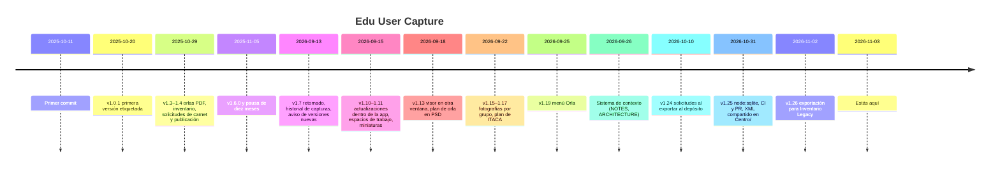

# Arquitectura

## Alto nivel

```mermaid
flowchart LR
  subgraph App["Edu User Capture (Electron)"]
    R["Renderer<br/>ventana principal y secundarias"]
    P["Preload<br/>window.electronAPI"]
    M["Proceso principal<br/>main.js + src/main"]
  end
  DB[("SQLite<br/>data/ del proyecto")]
  FS["Carpetas del proyecto<br/>ingest → imports"]
  DEP["Depósito compartido<br/>carpeta sincronizada + copia local"]
  PR["Auxiliar de recibos C#<br/>impresora térmica"]
  GH["GitHub Releases<br/>actualizaciones"]
  XML["XML del centro"]
  CI["GitHub Actions<br/>tipos, Jest, Electron real"]

  R -->|IPC| P --> M
  M --> DB
  M -->|chokidar| FS
  M --> DEP
  M -->|stdin/stdout JSON| PR
  M -->|electron-updater| GH
  XML --> M
  M -->|publica en Centro/| DEP
  DEP -->|XML más reciente| M
  CI -.->|cada push y PR| App
```

## Mapa de carpetas

```mermaid
flowchart TB
  root["user-capture-app/"]
  root --> main["main.js — arranque, ventanas, menú, vigilantes"]
  root --> src["src/"]
  src --> sm["main/ — BD, depósito, exportaciones, PDF, recibos, updates"]
  sm --> ipc["main/ipc/ — manejadores IPC por área"]
  src --> pre["preload/ — puente window.electronAPI"]
  src --> ren["renderer/ — UI: renderer.js + components/ + modals/"]
  src --> help["help/ — manual de uso en Markdown"]
  root --> nat["native/receipt-printer/ — auxiliar C# (GDI)"]
  root --> scr["scripts/ — build del auxiliar, notas de release, prototipos"]
  root --> tst["tests/unit/ — Jest: renderer (JSDOM) y main (Node)"]
  root --> docs["docs/ — planes, publicación, fallos pendientes"]
```

## Línea de tiempo

```mermaid
timeline
  title Edu User Capture
  2025-10-11 : Primer commit
  2025-10-20 : v1.0.1 primera versión etiquetada
  2025-10-29 : v1.3–1.4 orlas PDF, inventario, solicitudes de carnet y publicación
  2025-11-05 : v1.6.0 y pausa de diez meses
  2026-09-13 : v1.7 retomado, historial de capturas, aviso de versiones nuevas
  2026-09-15 : v1.10–1.11 actualizaciones dentro de la app, espacios de trabajo, miniaturas
  2026-09-18 : v1.13 visor en otra ventana, plan de orla en PSD
  2026-09-22 : v1.15–1.17 fotografías por grupo, plan de ITACA
  2026-09-25 : v1.19 menú Orla
  2026-09-26 : Sistema de contexto (NOTES, ARCHITECTURE)
  2026-10-10 : v1.24 solicitudes al exportar al depósito
  2026-10-31 : v1.25 node:sqlite, CI y PR, XML compartido en Centro/
  2026-11-02 : v1.26 exportación para Inventario Legacy
  2026-11-03 : Estás aquí
```

---

Generado a partir del repo el 2026-11-03; se regenera con /cerrar-sesion.
